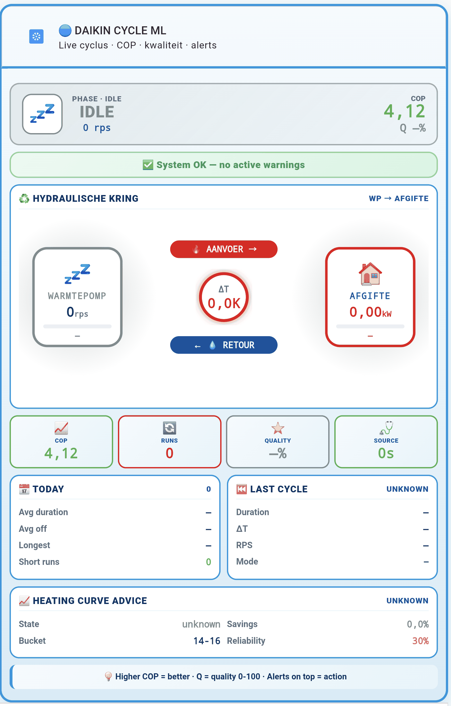

# Daikin Cycle ML

Home Assistant integration that detects compressor cycles, classifies
pendulum behaviour, self-learns per mode, and advises on Daikin Altherma
heat pumps. **Local-only ML, no cloud.**

**IoT class:** `calculated` — **Integration type:** `helper`

---

## Showcase

  
   
  <em>One-glance dashboard card — see <a href="dashboard/">dashboard/</a> for installation.</em>

---

## Table of contents

1. [Why](#1-why)
2. [Features](#2-features)
3. [Requirements](#3-requirements)
4. [Installation](#4-installation)
5. [Source sensor & attributes](#5-source-sensor--attributes)
6. [Config flow — step by step](#6-config-flow--step-by-step)
7. [Entities](#7-entities)
8. [Services](#8-services)
9. [Alerts & notifications](#9-alerts--notifications)
10. [ML pipeline](#10-ml-pipeline)
11. [Clustering](#11-clustering)
12. [Scheduled jobs](#12-scheduled-jobs)
13. [Retention & storage](#13-retention--storage)
14. [Database schema](#14-database-schema)
15. [Integration Quality Scale](#15-integration-quality-scale)
16. [Testing](#16-testing)
17. [Continuous integration](#17-continuous-integration)
18. [Troubleshooting](#18-troubleshooting)
19. [Out of scope](#19-out-of-scope)

---

## 1. Why

Pendelen (short-cycling) is the #1 cause of reduced COP and extra wear on
Daikin Altherma heat pumps. Existing HA integrations do not detect it,
because they look at temperature or power — not at the actual compressor
runtime pattern.

Daikin Cycle ML watches the ESPAltherma sensor stream, detects every
compressor cycle (start -> run -> stop), scores it, learns what "normal"
looks like for **your** installation per mode (Heating / Cooling / DHW),
and warns you when patterns drift.

No cloud. No external API. Everything runs inside your Home Assistant box.

---

## 2. Features

- **Cycle detection** — RPS threshold + optional power-sensor fallback
- **Water pump guard** — skips cycles where the pump is off
- **8 pendulum patterns** — per mode (Heating / Cooling / DHW), hourly + daily
- **Quality score 0-100** per cycle (runtime, dT, off-time, BUH, defrost)
- **thermal_kW per cycle** — computed from flow x 4.18 x dT
- **COP hourly rollup** (v1.3.0) — 6h scheduler aggregates cop_samples
  into cop_hourly (per-hour, per-mode: mean/p10/p50/p90/std,
  lwt_mean, outdoor mean/min/max, flow_mean)
- **COP KPI sensors** (v1.3.0) — sensor.cop_mean_day/week/month
  (heating-weighted mean, all-mode breakdown as attribute)
- **COP curve REST endpoint** (v1.3.0) —
  GET /api/daikin_cycle_ml/cop_hourly?days=N&mode=X (auth required,
  1..365 days)
- **COP curve sensor** (v1.3.0) — sensor.cop_curve_recent (48h window,
  ~8 KB attrs, recorder-safe for ApexCharts)
- **Export COP hourly** (v1.3.0) — daikin_cycle_ml.export_cop_hourly
  service (json/csv, up to 365 days)
- **MultiBaseline** — per-mode EWMA, dim 12, persistent, dim-guarded
- **AdaptiveThresholds** — percentile-based self-learning per mode (opt-in)
- **Weekly k-means clustering** + per-cycle nearest-centroid assignment
- **12-dim feature vector** — see section 10
- **Actionable advice** — priority-ordered, category-tagged, included in alerts
- **Setpoint-oscillation detection** — rolling window, tunable threshold
- **Rich sectioned alerts** — emoji + aligned rows + severity + mode + advice
- **Bilingual notifications** — EN + NL templates, per installation
- **Per-group alert toggles** — 5 groups: pendulum / short-cycle / ML /
  setpoint / COP-stooklijn
- **Test-notification dropdown** — 9 alert kinds + "all alerts" button
- **COP stooklijn analysis** — daily advice + bucket table, DHW-aware,
  48-hour recency window
- **Custom attribute map** — remap non-standard ESPAltherma firmware keys
- **SQLite persistence** — retention, daily rollups, auto-migration 8 -> 11 -> 12
- **24 entities** — 9 container sensors + 15 binary sensors
- **6 services** — reset, export, label, recompute, maintain, test-notify
- **5 repair issues** — source stale, missing attrs, DB corrupt, notify fail,
  migration fail
- **HA-compliant** — 8-step wizard, OptionsFlowWithReload, 8-screen menu
- **HACS-installable** — Custom repository, no workarounds
- **IQS Bronze + Silver + Gold**
- **6 CI workflows** — Ruff, Pylint, Coverage, Mypy (strict), HACS Validation,
  Hassfest

---

## 3. Requirements

- **Home Assistant** 2026.9.0 or newer
- **Python** 3.14 (matches HA 2026.9 baseline)
- **ESPAltherma** publishing attributes on a sensor
- Recommended: outdoor temp attribute + leaving-water temp attribute
  (needed for dT and COP)

---

## 4. Installation

### 4.1 Via HACS (recommended)

1. Install [HACS](https://hacs.xyz/docs/setup/download) if you haven't already.
2. In Home Assistant, go to **HACS -> Integrations -> (three dots, top right) -> Custom repositories**.
3. Add repository URL `https://github.com/elRadix/daikin_cycle_ml` with category **Integration**.
4. Click **Add** -> find **Daikin Cycle ML** in the list -> **Download**.
5. **Restart Home Assistant** (Settings -> System -> Restart).
6. **Settings -> Devices & Services -> Add Integration -> "Daikin Cycle ML"**.
7. Follow the 8-step wizard (section 6).

### 4.2 Manual installation

1. Copy `custom_components/daikin_cycle_ml/` into your HA config tree
   (usually `/config/custom_components/daikin_cycle_ml/`).
2. **Restart Home Assistant** (Settings -> System -> Restart).
   A config-entry reload is **not** enough when the module code changes.
3. **Settings -> Devices & Services -> Add Integration -> "Daikin Cycle ML"**.
4. Follow the 8-step wizard (section 6).

> **Upgrading from v1.0.x?** v1.1.0 restructured the repository to the
> HACS-compliant layout. If you installed manually before, replace your
> existing `/config/custom_components/daikin_cycle_ml/` with the new
> contents. Your configuration, entities and database are preserved.

---

## 5. Source sensor & attributes

Daikin Cycle ML reads from a single HA sensor (typically
`sensor.althermasensors` published by ESPAltherma). All processing is
based on the sensor's **attributes**.

### Required attributes (13)

Always processed. If any is missing, the `missing_attrs` repair is raised
and cycle detection may degrade.

| Attribute | Purpose |
|---|---|
| INV frequency (rps) | Compressor rotation speed -> cycle detection |
| Operation Mode | Fallback mode source |
| I/U operation mode | Primary mode source (Heating / Cooling / DHW) |
| 3way valve | DHW vs heating discrimination |
| Defrost Operation | Defrost flag on cycle record |
| Leaving water temp after BUH (R2T) | LWT — for dT and COP |
| Inlet water temp (R4T) | Inlet — for dT and COP |
| Flow sensor (l/min) | Water flow — for thermal kW |
| Water pump operation | Pump on/off — for cycle validity |
| Outdoor air temp (R1T) | Outdoor temp — for stooklijn bucketing |
| DHW tank temp (R5T) | DHW tank temp — for DHW recognition |
| BUH Step1 | Backup heater step 1 flag |
| BUH Step2 | Backup heater step 2 flag |

### Recommended attributes

Pre-selected in the wizard. Safe to enable. Improve quality and enable
extra features.

| Attribute | Purpose |
|---|---|
| Discharge pipe temp. | Compressor health indicator |
| Suction pipe temp. | Refrigerant-side context |
| INV primary current (A) | Extra power proxy |
| Target Cond. Temp. | Target condensing temp for stooklijn comparison |
| LW setpoint (main) | Required for setpoint_osc alert |
| DHW setpoint | DHW setpoint for DHW cycle context |

### Optional attributes

Default off. Enable only if your installation publishes them.

Heat exchanger mid-temp., Liquid pipe temp. (R6T), Expansion valve (pls),
Crank case heater 1, Pressure equalizing operation, 4 Way Valve 1,
Solenoid Valve 1, Target Evap. Temp., RT setpoint, High Pressure,
Water pressure, Brine inlet temp., Brine outlet temp.

> **Note on required attributes:** even if you deselect required attributes
> in the wizard, they are **always kept** — cycle detection depends on them.

### Custom attribute map

If your ESPAltherma firmware uses non-standard attribute names, the wizard
(Model = **Custom**) offers a JSON mapping. Left = standard key, right = your
actual attribute name. The integration renames your attribute to the
standard key before processing.

Rules:

- Valid JSON object (validated at wizard time)
- Empty or missing actual attribute -> original is left untouched
- Only affects the keys you list

Example:

    {
      "INV frequency (rps)": "my_rps",
      "Leaving water temp after BUH (R2T)": "my_lwt"
    }

---

## 6. Config flow — step by step

### 6.1 Setup wizard (8 steps)

Flow:

    user -> model_custom (conditional) -> attributes (check)
         -> cycle -> pendulum -> quality -> notifications -> finalize

#### Step 1 — `user` (Source & model)

| Field | Type | Default | Notes |
|---|---|---|---|
| `source_sensor` | entity picker | `sensor.althermasensors` | Your ESPAltherma sensor |
| `model` | dropdown | `EPRA12EAV3` | Or `Custom` for non-standard pumps |

Available models: `EPRA12EAV3`, `EPRA08EAV3`, `EABH16DA6V`, `EABX16DA6V`, `Custom`.

#### Step 2 — `model_custom` *(only shown when Model = Custom)*

| Field | Type | Notes |
|---|---|---|
| `custom_attribute_map` | JSON textarea | See section 5 |

Validated at wizard time. Invalid JSON -> inline error, wizard does not
advance.

#### Step 3 — `attributes` (warning-only)

Shows how many of the 13 core attributes are present on the selected
source sensor. Missing ones are listed but do **not** block the wizard.
You can proceed and fix later.

#### Step 4 — `cycle` (Cycle detection)

| Field | Default | Range | Notes |
|---|---|---|---|
| `compressor_rps_threshold` | 3 | 1–100 | Compressor considered "on" when RPS > this |
| `power_sensor_entity` | (none) | entity | Optional power-based fallback |
| `fallback_power_threshold_w` | 200 | 10–10000 | Used when RPS missing |
| `indoor_temp_sensor` | (none) | entity | Enables `indoor_temp_avg` in ML vector |

#### Step 5 — `pendulum` (Pendulum thresholds)

| Field | Default | Range |
|---|---|---|
| `short_run_threshold_min` | 20 | 1–240 |
| `short_off_threshold_min` | 5 | 1–120 |
| `pendulum_cycles_per_day` | 40 | 1–200 |
| `dhw_pendulum_cycles_per_hour` | 3 | 1–20 |

#### Step 6 — `quality` (Quality thresholds)

| Field | Default | Range |
|---|---|---|
| `good_run_threshold_min` | 45 | 1–240 |
| `good_dt_threshold_k` | 5.0 | 0.1–20.0 (step 0.1) |
| `good_off_threshold_min` | 20 | 1–240 |
| `target_cycles_per_day` | 8 | 1–100 |

#### Step 7 — `notifications` (Wizard-basic notifications)

| Field | Default |
|---|---|
| `persistent_enabled` | `true` |
| `notify_service` | (empty) |
| `quiet_hours_enabled` | `false` |
| `quiet_hours_start` | `22:00` |
| `quiet_hours_end` | `07:00` |

> Full notification configuration (alert groups, language, emoji, action
> advice, status updates, aggregation window) is available in the Options
> menu, screen 4 — see section 6.2.

#### Step 8 — `finalize`

Review screen. Submit -> integration starts polling every 30 seconds.

---

### 6.2 Options menu (8 screens)

Open via **Settings -> Devices & Services -> Daikin Cycle ML -> Configure**.
Each screen saves independently. All number fields have sensible min / max
validators enforced by the UI.

#### Screen 1 — `init` (menu)

Menu options:

    device
    pendulum
    quality
    notifications
    ml
    maintenance
    test_notification
    test_all_notifications

#### Screen 2 — `device`

| Field | Default | Range |
|---|---|---|
| `compressor_rps_threshold` | 3 | 1–100 |
| `power_sensor_entity` | (none) | entity |
| `fallback_power_threshold_w` | 200 | 10–10000 |
| `indoor_temp_sensor` | (none) | entity |
| `cop_sensor_entity` | (none) | entity — required for `cop_samples` |

#### Screen 3 — `pendulum`

| Field | Default | Range |
|---|---|---|
| `short_run_threshold_min` | 20 | 1–240 |
| `short_off_threshold_min` | 5 | 1–120 |
| `pendulum_cycles_per_hour` | 4 | 1–100 |
| `pendulum_cycles_per_day` | 40 | 1–200 |
| `dhw_pendulum_cycles_per_hour` | 3 | 1–20 |
| `setpoint_oscillation_threshold` | 6 | 1–100 |
| `setpoint_osc_window_min` | 30 | 5–180 |
| `setpoint_osc_min_delta` | 0.5 | 0.1–2.0 (step 0.1) |

#### Screen 4 — `quality`

| Field | Default | Range |
|---|---|---|
| `good_run_threshold_min` | 45 | 1–240 |
| `good_dt_threshold_k` | 5.0 | 0.1–20.0 (step 0.1) |
| `good_off_threshold_min` | 20 | 1–240 |
| `target_cycles_per_day` | 8 | 1–100 |

#### Screen 5 — `notifications` (16 fields)

| Field | Default | Range / Options |
|---|---|---|
| `persistent_enabled` | `true` | bool |
| `notify_service` | (empty) | dropdown (loaded at runtime) |
| `notify_emoji_enabled` | `true` | bool |
| `action_advice_enabled` | `true` | bool |
| `quiet_hours_enabled` | `false` | bool |
| `quiet_hours_start` | `22:00` | time |
| `quiet_hours_end` | `07:00` | time |
| `alert_aggregation_minutes` | 30 | 1–1440 |
| `status_update_enabled` | `false` | bool |
| `status_update_interval_hours` | 24 | 1–168 |
| `notification_language` | `en` | dropdown: `en`, `nl` |
| `alert_group_pendulum` | `true` | bool |
| `alert_group_short_cycle` | `true` | bool |
| `alert_group_ml` | `true` | bool |
| `alert_group_setpoint` | `true` | bool |
| `alert_group_cop_stooklijn` | `true` | bool |

#### Screen 6 — `ml` (Machine learning)

| Field | Default | Range |
|---|---|---|
| `adaptive_thresholds_enabled` | `false` | bool |
| `adaptive_min_samples` | 20 | 5–500 |

#### Screen 7 — `maintenance`

| Field | Default | Range |
|---|---|---|
| `retention_enabled` | `true` | bool |
| `cycle_retention_days` | 90 | 7–3650 |
| `alert_retention_days` | 30 | 7–3650 |
| `vacuum_enabled` | `true` | bool |

#### Screen 8a — `test_notification`

| Field | Default | Notes |
|---|---|---|
| `alert_kind` | `status_summary` | dropdown — 10 options, see below |
| `ignore_group_filters` | `false` | bool |

Available `alert_kind` options:

    status_summary
    pendulum_hourly
    pendulum_daily
    short_run
    short_off
    ml_anomaly
    setpoint_osc
    cop_low
    stooklijn_advies
    all_alerts

Submits and shows a **preview** of the rendered message. The preview
respects the currently configured language and emoji setting.

#### Screen 8b — `test_all_notifications`

Single submit button. Emits **every** alert kind in one shot — useful for
verifying EN/NL formatting, emoji, severity labels and the rich sectioned
layout at once. Ignores per-group filters (uses `ignore_filters=True`
internally).

---

### 6.3 Reconfigure

Two reconfigure paths, available via **Settings -> Devices & Services ->
Daikin Cycle ML -> Reconfigure**:

- `reconfigure_basic` — change `source_sensor` and `model` only. Prefilled
  with current values. Saves to config-entry DATA.
- `reconfigure_full` — re-run the full wizard, all steps prefilled. Use
  this if you want to re-apply default thresholds across the board.

> `source_sensor` and `model` live in the config-entry **DATA**, not
> OPTIONS. That's why they can only be changed via Reconfigure and not via
> the Options menu.

---

## 7. Entities

### 7.1 Container sensors (9)

| Entity | Unit | Device class | Description |
|---|---|---|---|
| `sensor.daikin_cycle_ml_cycle_state` | — | — | `idle` / `active` |
| `sensor.daikin_cycle_ml_current_cycle` | — | — | Current cycle mode + duration attribute |
| `sensor.daikin_cycle_ml_last_cycle` | score | — | Last cycle quality + cluster attribute |
| `sensor.daikin_cycle_ml_today` | — | — | Cycles since midnight |
| `sensor.daikin_cycle_ml_quality_today` | score | — | Average quality today |
| `sensor.daikin_cycle_ml_source_health` | s | DURATION | Seconds since last source update |
| `sensor.daikin_cycle_ml_learned_thresholds` | min | DURATION | Adaptive threshold (if enabled) |
| `sensor.daikin_cycle_ml_cop_vandaag` | COP | — | Today's average COP |
| `sensor.daikin_cycle_ml_stooklijn_advies` | — | — | `verlaag_lwt_2c` / `verhoog_lwt_2c` / `behoud` / `unknown`, with `reason` attribute |

Cluster membership: `state_attr('sensor.daikin_cycle_ml_last_cycle', 'cluster')`.

### 7.2 Binary sensors (15)

| Entity | Device class | Description |
|---|---|---|
| `compressor_running` | RUNNING | Compressor currently on |
| `pendulum_hourly` | PROBLEM | Cycles/hour >= threshold |
| `pendulum_daily` | PROBLEM | Cycles/day >= threshold |
| `short_run` | PROBLEM | Last cycle < short-run threshold |
| `short_off` | PROBLEM | Off-time < short-off threshold |
| `defrost_active` | RUNNING | Defrost in progress |
| `buh_active` | HEAT | BUH Step1 or Step2 on (attr: `step=1` or `2`) |
| `dhw_active` | — | Currently in DHW mode |
| `heating_active` | HEAT | Currently in heating mode |
| `cooling_active` | COLD | Currently in cooling mode |
| `source_stale` | PROBLEM | Source sensor not fresh |
| `missing_attributes` | PROBLEM | Required attributes missing |
| `setpoint_oscillating` | PROBLEM | Setpoint changes >= threshold |
| `dhw_pendulum` | PROBLEM | DHW cycles/h >= DHW threshold |
| `high_cycle_rate` | PROBLEM | Cycles/h > 1.5 x target |

---

## 8. Services

All under `daikin_cycle_ml`.

### 8.1 `reset_counters`

Reset daily counters. No parameters.

### 8.2 `export_cycles`

| Field | Type | Default |
|---|---|---|
| `days` | int | 30 |
| `format` | string | `json` (or `csv`) |
| `path` | string | `/config/daikin_cycles_export.json` |

### 8.3 `label_cycle`

| Field | Type | Required |
|---|---|---|
| `cycle_id` | int | yes |
| `label` | string | yes |

### 8.4 `recompute_baseline`

| Field | Type | Default |
|---|---|---|
| `days` | int | 30 |

### 8.5 `run_maintenance`

No parameters. Runs retention prune + optional VACUUM.

### 8.6 `send_test_notification`

| Field | Type | Default |
|---|---|---|
| `entry_id` | string | auto-resolved if 1 entry |
| `message` | string | `Daikin Cycle ML: test notification` |
| `target` | string | from options |

**Response:** `{"ok": bool, "target": str, "message": str}`.

Example:

    service: daikin_cycle_ml.send_test_notification
    data:
      message: "Hello from Daikin Cycle ML"

---

## 9. Alerts & notifications

Every alert is rendered as a **rich sectioned message** in the selected
language (EN or NL).

### 9.1 Structure

    Daikin Cycle ML — Pendulum (hourly)
    2026-09-26 14:32
    ----------------------
    Cycles/hour     5
    Target          <= 4
    Mode            heating
    LWT setpoint    35.0 C
    Avg duration    14 min
    Outdoor         14.7 C
    ----------------------
    Advice: increase thermostat hysteresis, or lower the heat curve
    so cycles run longer.

Emoji prefixes are added per alert type when `notify_emoji_enabled = true`.

### 9.2 Alert matrix

| Alert | Trigger | Severity | Group | Dedup |
|---|---|---|---|---|
| `pendulum` (hourly) | cycles/h >= target | warning | pendulum | 30 min |
| `pendulum` (daily) | cycles today >= target | warning | pendulum | 30 min |
| `short_run` | last cycle < threshold | warning | short_cycle | 30 min |
| `short_off` | off-time < threshold | warning | short_cycle | 30 min |
| `ml_anomaly` | z-score >= watch (2.0) | warn / crit | ml | 30 min |
| `setpoint_osc` | N changes in window | warning | setpoint | 30 min |
| `cop_low` | daily COP < 2.5 | warning | cop_stooklijn | 20 h |
| `stooklijn_advies` | daily heat-curve advice | warning | cop_stooklijn | 20 h |
| `status_update` | opt-in periodic | info | — | interval |

### 9.3 Delivery channels

Two independent channels — a failure in one does not block the other:

1. **Persistent notification** — HA sidebar (if `persistent_enabled`)
2. **Notify target** — any `notify.*` entity (entity- or legacy-service)

The `AlertSpec.context` dictionary is passed to `notify.*` payloads but
**not** to `persistent_notification` (HA does not support extra keys
there).

### 9.4 Quiet hours

Non-critical alerts are suppressed inside the window (default
22:00 -> 07:00). Wraparound-aware: 22:00 -> 07:00 spans midnight
correctly.

### 9.5 Per-group toggles

5 independent groups, configurable in **Options -> Notifications**:

    pendulum
    short_cycle
    ml
    setpoint
    cop_stooklijn

### 9.6 Emoji

Per alert type, severity as fallback. Disable with **Emoji** = `false`.

| Alert | Emoji |
|---|---|
| pendulum | bell |
| short_run | hourglass |
| short_off | zzz |
| ml_anomaly | brain |
| setpoint_osc | target |
| cop_low / stooklijn_advies | chart-down |
| status_update | chart |

---

## 10. ML pipeline

Every closed cycle becomes a **12-dimensional feature vector**:

    [0]  duration_s
    [1]  dT_max
    [2]  dT_avg
    [3]  rps_max
    [4]  rps_avg
    [5]  outdoor_temp
    [6]  buh_used
    [7]  defrost_used
    [8]  cop_avg
    [9]  lwt_avg
    [10] indoor_temp_avg
    [11] thermal_kw_avg          (added in v0.7.0)

Missing values -> `0.0` (JSON-safe).

Three self-learning layers:

### 10.1 MultiBaseline

Per-mode **EWMA** with Welford-style variance. Produces z-scores per
dimension for anomaly detection.

- Persisted to `model_state['baseline_state']`
- Dim-guarded: legacy 8-dim or 11-dim baseline resets on load

### 10.2 AdaptiveThresholds

Per-mode percentile. Learns `short_run` and `good_off` from your real
cycles. **Opt-in** via `adaptive_thresholds_enabled`.

- Requires `adaptive_min_samples` cycles (default 20)
- Persisted to `model_state['adaptive_thresholds']`
- Exposed via `sensor.learned_thresholds`

### 10.3 K-means clustering

Weekly retrain over last 7 days -> 3 centroids. See next section.

---

## 11. Clustering

Weekly k-means over the last 7 days -> **3 centroids**.

New cycles get `cluster_id` via **nearest-centroid**. Labels are
auto-derived:

- **shortest mean duration** -> `cluster_pendulum`
- **highest dT_max** -> `cluster_dhw_like`
- **rest** -> `cluster_normal`

Exposed as attribute on `sensor.daikin_cycle_ml_last_cycle`.

Persisted to `model_state['kmeans_state']`.

---

## 12. Scheduled jobs

| When | What |
|---|---|
| Every 30 s | Poll sensor, detect cycle transitions, dispatch alerts |
| Every 10 min | Collect COP sample (if COP sensor configured) |
| Every 1 h | Refresh stooklijn cache + daily COP counters |
| Every 6 h | Persist baseline + adaptive state to `model_state` |
| Daily 03:00 | Retention rollup + prune + optional VACUUM |
| Daily 04:00 | Stooklijn analysis (force refresh + notify) |
| Sunday 04:00 | K-means retrain over last 7 days |
| Every N h (opt-in) | Status summary via `build_status_message` |

---

## 13. Retention & storage

- **Storage**: `/config/.storage/daikin_cycle_ml.db` (SQLite via `aiosqlite`)
- **Cycle retention**: `cycle_retention_days` (default **90**) — older cycles
  rolled up into `daily_summary` before pruning
- **Alert retention**: `alert_retention_days` (default **30**)
- **Features**: orphan-pruned via FK
- **VACUUM**: optional, runs after prune
- **Migration**: automatic (8 -> 11 -> 12 dim), idempotent

---

## 14. Database schema

**7 tables**:

### 14.1 `cycles`

    id             INTEGER PRIMARY KEY
    start_ts       REAL
    end_ts         REAL
    duration_s     REAL
    mode           TEXT      -- heating / cooling / dhw / unknown
    dT_max         REAL
    dT_avg         REAL
    rps_max        INT
    rps_avg        REAL
    outdoor_temp   REAL
    buh_used       INT
    defrost_used   INT
    quality_score  INT
    cluster_id     INTEGER   -- nullable
    label          TEXT      -- nullable
    thermal_kw_avg REAL      -- nullable (v0.7.0+)

### 14.2 `features`

    id          INTEGER PRIMARY KEY
    cycle_id    INTEGER FK -> cycles(id)
    vector_json TEXT         -- JSON array of 12 floats

### 14.3 `alerts`

    id         INTEGER PRIMARY KEY
    alert_type TEXT
    severity   TEXT
    message    TEXT
    ts         REAL
    notif_id   TEXT

### 14.4 `daily_summary`

    day          TEXT   -- YYYY-MM-DD
    mode         TEXT
    cycles       INTEGER
    quality_avg  REAL
    duration_avg REAL
    PRIMARY KEY (day, mode)

### 14.5 `cop_samples`

    id            INTEGER PRIMARY KEY
    ts            REAL
    cop           REAL
    lwt           REAL
    outdoor       REAL
    flow_lmin     REAL
    power_stable  INT
    mode          TEXT   -- NULL / dhw / heating / cooling / unknown (v13+)

### 14.6 `model_state`

    key         TEXT PRIMARY KEY
    value_json  TEXT NOT NULL
    updated_ts  REAL NOT NULL

Keys: `baseline_state`, `adaptive_thresholds`, `kmeans_state`,
`last_maintenance_ts`.

### 14.7 `sqlite_sequence`

SQLite internal.

---

## 15. Integration Quality Scale

Status: **Bronze + Silver + Gold**.

See `quality_scale.yaml` for the full status.

### 15.1 Bronze

| Rule | Status |
|---|---|
| config-flow | pass |
| config-flow-test-coverage | pass |
| test-coverage | pass (>= 95%) |
| action-setup | pass |
| runtime-data | pass |
| entity-unique-id | pass |
| has-entity-name | pass |
| brands | pass |
| docs-* (10 rules) | pass |

### 15.2 Silver

| Rule | Status |
|---|---|
| parallel-updates | pass (`PARALLEL_UPDATES = 0`) |
| integration-owner | pass (codeowners) |
| test-coverage | pass |
| config-entry-unloading | pass |
| action-exceptions | pass |
| reauthentication-flow | exempt (local source) |
| entity-unavailable | pass |

### 15.3 Gold

| Rule | Status |
|---|---|
| devices | pass |
| diagnostics | pass |
| repair-issues | pass |
| entity-translations | pass (EN + NL) |
| reconfiguration-flow | pass |
| entity-device-class | pass |
| entity-category | pass |
| discovery | exempt (calculated) |
| dynamic-devices | exempt |
| stale-devices | exempt |

### 15.4 Platinum (not targeted)

| Rule | Status |
|---|---|
| strict-typing | **pass** (`mypy --strict`, 0 errors, 30 modules) |
| py.typed | pass |
| async-dependency | partial (`aiosqlite` is async) |
| inject-websession | exempt |

---

## 16. Testing

- **1466 tests, 4 skipped** — **97.16% coverage**
- Framework: `pytest` + `pytest_homeassistant_custom_component` (phcc)
- **Coverage threshold enforced at 95%** (`--cov-fail-under=95`)
- **Ruff clean** — HA 2026+ config (line-length 100, py314, select E/W/F/I/UP/B/SIM/RET/PIE/C4/RUF)
- **Pylint 10.00/10** — `--fail-under=8.0` gate, integration code only
- **`mypy --strict`** — 0 errors, 30 source files, directory-based
- **Import smoke** — 130 modules via `importlib.import_module()`
- **SQLite integrity** — `PRAGMA integrity_check` in CI

Per-module coverage:

| Module | Coverage |
|---|---|
| `custom_components/daikin_cycle_ml/__init__.py` | 98% |
| `custom_components/daikin_cycle_ml/binary_sensor.py` | 100% |
| `custom_components/daikin_cycle_ml/config_flow.py` | 95% |
| `custom_components/daikin_cycle_ml/const.py` | 100% |
| `custom_components/daikin_cycle_ml/coordinator.py` | 96% |
| `custom_components/daikin_cycle_ml/diagnostics.py` | 100% |
| `custom_components/daikin_cycle_ml/engine/action_engine.py` | 100% |
| `custom_components/daikin_cycle_ml/engine/anomaly_engine.py` | 95% |
| `custom_components/daikin_cycle_ml/engine/attribute_reader.py` | 100% |
| `custom_components/daikin_cycle_ml/engine/cop_analyzer.py` | 99% |
| `custom_components/daikin_cycle_ml/engine/cycle_detector.py` | 99% |
| `custom_components/daikin_cycle_ml/engine/model_profiles.py` | 100% |
| `custom_components/daikin_cycle_ml/engine/notification_engine.py` | 97% |
| `custom_components/daikin_cycle_ml/engine/quality_scorer.py` | 100% |
| `custom_components/daikin_cycle_ml/engine/status_report.py` | 96% |
| `custom_components/daikin_cycle_ml/engine/timer_health.py` | 100% |
| `custom_components/daikin_cycle_ml/entity.py` | 100% |
| `custom_components/daikin_cycle_ml/ml/adaptive_thresholds.py` | 100% |
| `custom_components/daikin_cycle_ml/ml/baseline.py` | 99% |
| `custom_components/daikin_cycle_ml/ml/clustering.py` | 97% |
| `custom_components/daikin_cycle_ml/ml/features.py` | 100% |
| `custom_components/daikin_cycle_ml/ml/multi_baseline.py` | 100% |
| `custom_components/daikin_cycle_ml/repairs.py` | 100% |
| `custom_components/daikin_cycle_ml/sensor.py` | 97% |
| `custom_components/daikin_cycle_ml/services.py` | 96% |
| `custom_components/daikin_cycle_ml/storage/db.py` | 96% |
| `custom_components/daikin_cycle_ml/storage/store.py` | 96% |
| **TOTAL** | **97.16%** |

Run locally:

    PYTHONPATH=/workspace pytest -q

Run ruff:

    ruff check --no-fix --select E,F,W --ignore E501,E402,F401 --exclude tests

Run pylint:

    FILES=$(git ls-files '*.py' | grep -v '^tests/' | grep -v '^docs/')
    pylint --rcfile=.pylintrc $FILES --fail-under=8.0

Run mypy strict (directory-based):

    python3 -m mypy --strict --python-version 3.14 \
      --follow-imports=silent --ignore-missing-imports \
      custom_components/daikin_cycle_ml

---

## 17. Continuous integration

Six GitHub Actions workflows run on every push and PR to `main`:

| Workflow | What it checks | File |
|---|---|---|
| **Ruff** | Lint (`E,F,W` minus `E501,E402,F401`, excludes tests) | `.github/workflows/ruff.yml` |
| **Pylint** | `--fail-under=8.0` on integration code | `.github/workflows/pylint.yml` |
| **Coverage** | Full suite + `--cov-fail-under=95` | `.github/workflows/coverage.yml` |
| **Mypy** | `mypy --strict`, Python 3.14, HA 2026.9.3 stubs | `.github/workflows/mypy.yml` |
| **HACS Validation** | `hacs/action@main`, category `integration` | `.github/workflows/hacs.yml` |
| **Hassfest** | Official HA integration validator | `.github/workflows/hassfest.yml` |

All six must pass before a release is tagged.

---

## 18. Troubleshooting

### Binary sensors stay off (`heating_active`, `cooling_active`, `dhw_active`)

- **Fixed in v0.6.0.** Upgrade if older.
- Still stuck after upgrade -> **full HA restart** (not config-entry reload).

### `source_stale` repair is shown

- ESPAltherma not publishing fresh data.
- Check ESP device and Wi-Fi. Repair resolves automatically.

### `missing_attrs` repair is shown

- Source sensor missing one or more required attributes.
- Verify ESPAltherma fields, or add a custom attribute map.

### Alerts are noisy

- Increase **Alert aggregation (minutes)**.
- Disable unneeded alert groups.
- Raise **Pendulum cycles per hour** / **per day**.
- Enable **Quiet hours**.

### Notifications are in the wrong language

- **Options -> Notifications -> Notification language** -> `en` or `nl`.

### `setpoint_osc` alert never fires

- Check source publishes **LW setpoint (main)**.
- Default threshold is **6 changes / 30 min** — most installs never hit it
  (that's the point).

### `cop_vandaag` sensor stays at 0

- Configure a **COP sensor** in **Options -> Device**.
- Samples collected every 10 min.

### Database grows too large

- Lower **Cycle retention (days)** in **Options -> Maintenance**.
- Ensure `vacuum_enabled = true`.
- Manual: `daikin_cycle_ml.run_maintenance`.

### HACS does not show the integration after adding the custom repository

- Confirm category = **Integration** (not Dashboard, not Template).
- Confirm the repository URL ends with `daikin_cycle_ml` (no `.git`).
- Refresh HACS: **HACS -> Integrations -> three dots -> Reload**.

### `hassfest` CI workflow fails with `KeyError: 'data'`

- Only relevant if you are contributing to the code. This is fixed in
  v1.1.0. If you fork: any step with `data_description` must also have a
  `data` block (and vice versa for menu / info-only steps).

### `hassfest` CI workflow fails on manifest key order

- Only relevant if you are contributing. `manifest.json` keys must be
  `domain`, `name`, then **alphabetical**. Verify with:

      python3 -c "import json; k=list(json.load(open('custom_components/daikin_cycle_ml/manifest.json')).keys()); assert k[:2]==['domain','name']; assert k[2:]==sorted(k[2:]); print('OK')"

### `hassfest` CI workflow fails on translation placeholders

- Only relevant if you are contributing. Any `{...}` in a translation
  string must be escaped as `{{...}}` (unless it is a valid placeholder
  identifier `[a-zA-Z_][a-zA-Z0-9_]*`).

---

## 19. Out of scope

- Cost tracking / € calculations
- Setpoint writes
  is optional and not on the roadmap)
- Supervised ML (label-based training)
- Weather forecast integration
- Brine circuits (EPRA12 is split air-water)
- Web UI cycle-explorer

---

## Support

Daikin Cycle ML is free and open-source, built and maintained in my own
time. No cloud, no accounts, no telemetry — your heat pump data stays on
your Home Assistant instance.

If this integration has helped you cut down pendelen, understand your
cycles, or improve your COP, a coffee is always appreciated and helps
keep the project going.

## License

See [LICENSE](LICENSE).