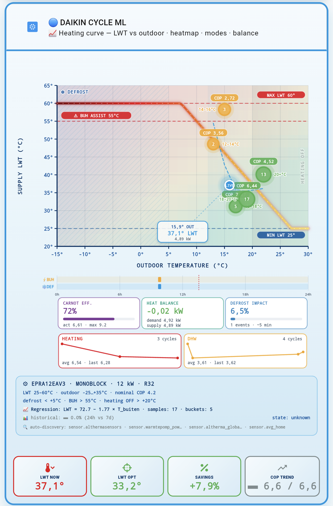

# Dashboard Cards — Daikin Cycle ML

Ready-to-use Lovelace dashboard cards for the **Daikin Cycle ML** integration.

## Available Cards

| Card | Description | Preview | Requires |
|---|---|---|---|
| [**Simple Card**](cards/simple-card/README.md) | Live phase, hydraulic diagram, COP, quality, alerts, stooklijn advice |  | v1.4.0+ |
| [**Heating Curve**](cards/heating-curve/README.md) | HP spec-aware visual with COP heatmap, regression & live position |  | v1.4.0+ |

---

## Requirements

### Backend (integration)
- **daikin_cycle_ml** `>= v1.4.0`
- Exposed entities:
  - `sensor.daikin_cycle_ml_heating_curve_advice`
  - `sensor.daikin_cycle_ml_cycle_state`
  - `sensor.daikin_cycle_ml_last_cycle`
  - `sensor.daikin_cycle_ml_cop_mean_day`
  - `sensor.daikin_cycle_ml_cop_mean_week`
  - `sensor.daikin_cycle_ml_thermal_power_live` (optional, kW callout)
- Exposed attributes on `cycle_state`:
  - `configured_language` — auto-detected language (`nl` / `en`)
  - `configured_model` — HP model key (e.g. `epra12eav3`)
  - `configured_source_sensor`, `configured_power_sensor`, `configured_cop_sensor`, `configured_indoor_sensor`
- Exposed attributes on `heating_curve_advice`:
  - `huidige_lwt`, `optimale_lwt`, `besparing_cop_pct`
  - `bucket`, `samples`, `buckets` (dict: `{ "<outdoor-bucket>": { cop, n, lwt }, ... }`)
  - `reason`, `comfort_impact`, `betrouwbaarheid`

### Frontend (HACS cards)

| Card | Repo | Purpose |
|---|---|---|
| `stack-in-card` | [custom-cards/stack-in-card](https://github.com/custom-cards/stack-in-card) | Wrapper |
| `mushroom-template-card` | [piitaya/lovelace-mushroom](https://github.com/piitaya/lovelace-mushroom) | Header |
| `button-card` | [custom-cards/button-card](https://github.com/custom-cards/button-card) | SVG content |
| `card-mod` | [thomasloven/lovelace-card-mod](https://github.com/thomasloven/lovelace-card-mod) | Border + shadow styling |

---

## Installation

1. Copy `heating-curve.yaml` to your dashboard
2. Open **Lovelace → Raw config editor**
3. Paste the YAML inside a view
4. Save

The card auto-detects your HP model, integration language, and configuration — no manual entity IDs required.

---

## Features

### 🎨 Visual
- **COP heatmap** — 2D Carnot-based grid behind the plot (red → yellow → green)
- **HP spec-aware axes** — Y-axis auto-scales to your heat pump's LWT range
- **Auto-zoom** — X-axis focuses on bucket spread when data is available
- **Live dot** — Pulsing last-cycle outdoor × current LWT position with animated ring
- **Bucket bubbles** — Size = sample count · Color = COP quality · Labels = n + COP
- **Regression curve** — Linear fit through buckets with formula label
- **Zone overlays** — Defrost (hachure), warm tint, heating OFF, BUH assist band

### ⚙️ Auto-discovery
- Reads `configured_model` to select HP specs from a lookup table (14 models: EPRA / ERLA, 04–16 kW)
- Reads `configured_*` sensors for the config footer
- Graceful fallbacks when attributes are missing

### 🌐 Bilingual (NL / EN)
- Language detected from `configured_language` attribute
- All labels translated via `t('key')` helper
- Fallback to English when attribute missing or unknown

### 📐 Info panels
- **Specs box** — model, family, kW, refrigerant, LWT/outdoor ranges, thresholds, regression formula, samples, buckets
- **Config footer** — auto-discovered sensors (source, power, COP, indoor)
- **Regression + samples counter**
- **COP trend** — 24h vs 7d rolling comparison

---

## Data & limitations

### HP specs are indicative
`HP_SPECS` values (kW, nominal COP, LWT ranges, refrigerant) are **indicative** and derived from public Altherma 3 datasheets. Verify against your own unit before relying on the thresholds for control decisions.

### `buckets` structure
The card reads `buckets` from `sensor.daikin_cycle_ml_heating_curve_advice`. Keys follow `bucket_for_outdoor()` in the integration:
- `-10-` — outdoor < -10 °C
- `-10--8`, `-8--6`, `-2-0`, `0-2`, `2-4`, …, `18-20` — 2 °C buckets
- `20+` — outdoor ≥ 20 °C
- `unknown` — dropped

Each bucket value is `{ cop: float, n: int, lwt: float|None }`.

### Live dot uses last completed cycle
`_attrs_current_cycle` does not expose `outdoor_temp` in v1.4.0 — the live dot therefore reads `outdoor_temp` from `sensor.daikin_cycle_ml_last_cycle`.

### Not yet available
DHW and historical overlays are **not** in this release — the integration does not expose `dhw_buckets` / `history_buckets` yet.

---

## Customization

### Change default language
Edit inside `custom_fields.content` → SVG JS:
```js
var LANG = 'en';   // force 'nl' or 'en'