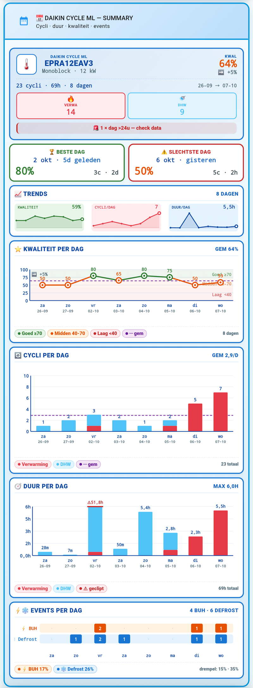

# Daily Summary Card — Daikin Cycle ML

A powerful Lovelace card for the **Daikin Cycle ML** integration. It renders
the full cycle history exposed by
`sensor.daikin_cycle_ml_daily_summary_recent` as dynamic SVG charts:
sparklines, a dynamically colored quality line chart, stacked
cycles / duration bars, and a BUH / defrost event strip. Auto-scaling,
HP-spec-aware hero, fully bilingual (NL / EN).

**Requires:** Daikin Cycle ML `>= v1.7.1`
**Frontend deps:** `stack-in-card`, `mushroom-template-card`, `button-card`, `card_mod`
**HA Core:** 2026.9+

---

## Table of contents

- [Preview](#preview)
- [What it shows](#what-it-shows)
- [Color coding](#color-coding)
- [Features](#features)
  - [Dynamic and smart](#dynamic-and-smart)
  - [Quality trending](#quality-trending)
  - [Interactive](#interactive)
  - [Robust](#robust)
- [Language switch](#language-switch)
- [Installation](#installation)
  - [Requirements](#requirements)
  - [Step 1: Install the frontend cards](#step-1-install-the-frontend-cards)
  - [Step 2: Add the card](#step-2-add-the-card)
  - [Step 3: Configure (optional)](#step-3-configure-optional)
- [Entity mapping](#entity-mapping)
- [Test scenarios](#test-scenarios)
- [Troubleshooting](#troubleshooting)
- [Customization](#customization)
- [Data sources](#data-sources)
- [Performance](#performance)
- [License](#license)

---

## Preview

[](showcase.png)

Rendered with real production data (8 days, 19 cycles). Click the image to
open it full-size.

- Local image: [`showcase.png`](showcase.png)
- Raw image URL:
  `https://raw.githubusercontent.com/elRadix/daikin_cycle_ml/main/dashboard/cards/daily-summary/showcase.png`

---

## What it shows

| Section | Content |
|---|---|
| Header | Title + subtitle with icon |
| Hero | Model · family · kW + total cycles / hours + average quality + trend |
| Best / Worst day | Top and worst quality day with date + relative time |
| Sparklines | 3 mini-charts: quality · cycles/day · duration/day |
| Quality per day | Line chart with dynamically colored segments (green / orange / red) |
| Cycles per day | Stacked bars per mode (heating / DHW / cooling) with average line |
| Duration per day | Stacked bars in hours with dynamic cap |
| Events per day | BUH and defrost events on a shared time axis |

---

## Color coding

| Element | Color | Meaning |
|---|---|---|
| Heating | Fire red `#E63946` | Compressor heating the house |
| DHW | Light blue `#4FC3F7` | Domestic hot water cycle |
| Cooling | Dark blue `#0D47A1` | Cooling mode |
| BUH | Amber `#E65100` | Backup heater active |
| Defrost | Medium blue `#1976D2` | Defrost cycle |
| Quality good | Green `#2E7D32` | >= 70% |
| Quality mid | Orange `#E65100` | 40-69% |
| Quality low | Red `#C62828` | < 40% |

---

## Features

### Dynamic and smart

- **Auto-scaling charts** — Y-axis, bar width, and label density adapt to
  the number of days (1 to 90+).
- **Nice-number Y-axes** — round values (1, 2, 5, 10, 20, 50, 100).
- **p95-based duration cap** — no false clipping; adapts to the dataset.
- **Outlier detection** — days with more than 24 h runtime are marked.
- **Big-number formatters** — `1234` renders as `1.2k`, `720 h` as `30d`.
- **Auto-hide** — empty modes (for example no cooling) are hidden
  automatically.
- **Smart label density** — at 60+ days only every 7th label is drawn.

### Quality trending

- **Dynamically colored line** — the segment between two points takes the
  color of the average quality (`qColor((a.q + b.q) / 2)`).
- **Zone bands** — green / orange / red background bands for context.
- **Purple dashed line** — average over the whole period.
- **Trend indicator** — `+5%` shows the first-half vs second-half delta.
- **Value labels** — at 21 days or fewer every dot shows its value.

### Interactive

- **SVG `<title>` tooltips** — hover bars and points for full data.
- **Responsive** — adapts to mobile, tablet, and desktop.
- **Chip legends** — color coding as scannable pills.

### Robust

- **Try/catch wrapper** — shows a readable summary error instead of
  crashing.
- **Full fallbacks** — `null` / `unknown` / `unavailable` render as `—`.
- **24/7-aware** — works with continuous operation (large totals, many
  cycles).

---

## Language switch

One line at the top of the JS template controls the language:

```js
var LANG = 'nl';   /* 'nl' | 'en' */
```

| Element | NL | EN |
|---|---|---|
| Date format | `7 okt · wo` | `7 Oct · Wed` |
| Sections | `Cycli per dag` | `Cycles per day` |
| Legend | `Verwarming / DHW` | `Heating / DHW` |
| Relative time | `2d geleden` | `2d ago` |
| Chips | `Goed >= 70` | `Good >= 70` |
| Tooltips | `Verwarming 3x` | `Heating 3x` |

To change: open the card in Lovelace edit-mode, find `var LANG = 'nl';`,
change to `'en'`, save. The card switches immediately.

---

## Installation

### Requirements

HACS frontend cards (install via **HACS → Frontend**):

| Card | Purpose |
|---|---|
| `stack-in-card` | Wrapper for the cards (border, gradient) |
| `mushroom-template-card` | Header |
| `button-card` | Body with `custom_fields` for the JS template |
| `card_mod` | CSS styling (border, gradients, colors) |

Integration:

- Daikin Cycle ML **v1.7.1 or newer**
- Sensor `sensor.daikin_cycle_ml_daily_summary_recent` must exist
- Optional: `sensor.daikin_cycle_ml_hp_specs` for model info in the hero

### Step 1: Install the frontend cards

Via **HACS → Frontend → Explore & Download Repositories**:

- `custom-cards/stack-in-card`
- `piitaya/lovelace-mushroom`
- `custom-cards/button-card`
- `thomasloven/lovelace-card-mod`

Restart Home Assistant after installation. Hard-refresh the browser
(`Ctrl+Shift+R`).

### Step 2: Add the card

**Method A — raw configuration editor (recommended):**

1. Open the Lovelace dashboard in edit-mode.
2. **+ Add card → Manual**.
3. Paste the full YAML from `daily-summary.yaml`.
4. Save.

**Method B — YAML file:** add it to `ui-lovelace.yaml` or a dashboard YAML
under `views[].cards[]`.

### Step 3: Configure (optional)

If you use different entity IDs, change them in the JS template:

```js
var SUMMARY = 'sensor.daikin_cycle_ml_daily_summary_recent';
var SPECS   = 'sensor.daikin_cycle_ml_hp_specs';
var LANG    = 'nl';
```

---

## Entity mapping

The card is 100% read-only. It reads from:

### `sensor.daikin_cycle_ml_daily_summary_recent`

| Attribute | Used for |
|---|---|
| `state` | Total cycles |
| `days_available` | Day count |
| `latest_day`, `oldest_day` | Date range in the hero |
| `days[]` | Per-day data: `cycles`, `dur_min`, `quality_avg`, `buh`, `defrost`, `mode` |
| `totals_by_mode` | Heating / DHW / Cooling totals |

### `sensor.daikin_cycle_ml_hp_specs`

| Attribute | Used for |
|---|---|
| `model` | Hero: for example `EPRA12EAV3` |
| `family` | Hero: for example `Monoblock` |
| `kw` | Hero: for example `12 kW` |

If an attribute is missing, the card shows `—` and keeps working.

---

## Test scenarios

| Scenario | Expected behavior |
|---|---|
| 8 days, 2 cycles/day | Everything visible normally |
| 30 days, 144 cycles/day | Bars ~10 px, labels every 3rd day |
| 90 days 24/7 | Bars 3 px, labels every 7th day, big numbers |
| DHW > 24 h outlier | Cap to 24 h, warning chip appears |
| No cooling | Cooling tile and legend hidden |
| 1 day of data | Best / worst are the same day, charts with 1 element |
| All sensors `unknown` | All values render `—`, no crash |
| JS error | Shows `Summary error: [message]` |

---

## Troubleshooting

### `ButtonCardJSTemplateError`

A JS error occurred inside the template. Open the browser console (F12),
find the line number, and compare with the original template. The template
has a try/catch wrapper, so most errors are caught and shown as a summary
error instead of a blank card.

### Card shows `—` everywhere

Entity not found or attributes missing. Verify via **Developer Tools →
Template**:

```jinja
{{ states('sensor.daikin_cycle_ml_daily_summary_recent') }}
{{ state_attr('sensor.daikin_cycle_ml_daily_summary_recent', 'days') | length }}
```

- Empty result → check the integration, restart HA.
- Populated result → entity ID mismatch in the card.

### Charts overlap or text disappears

`button-card` inherits `white-space: nowrap`. Make sure
`white-space: normal !important` is present on `.d-sec`, `.d-hdr`, and the
outer `<div>` in the JS template.

### Quality section missing

`quality_avg` is `null` for all days. Wait until cycles with a quality
score have completed — the value is computed at every full cycle.

---

## Customization

### Colors

Search in the JS template for:

```js
var C = {
  heating: '#E63946',
  dhw:     '#4FC3F7',
  cooling: '#0D47A1',
  buh:     '#E65100',
  defrost: '#1976D2',
  quality: '#2E7D32',
  gem:     '#6A1B9A'
};
```

### Add a language

Add a new language to the `STR` object:

```js
var STR = {
  nl: { /* ... */ },
  en: { /* ... */ },
  de: {
    summary: 'ZUSAMMENFASSUNG',
    days: 'Tage',
    cycles: 'Zyklen',
    /* ... full mirror of the NL keys ... */
  }
};
```

Change `var LANG = 'de';` and the card switches immediately.

### Adjust the cap

The dynamic duration cap:

```js
var c2Cap = Math.max(4, Math.min(24, roundNice(Math.max(p95 * 1.15, 4))));
```

- `4` — minimum cap (hours)
- `24` — maximum cap (physical limit)
- `p95 * 1.15` — 15% margin above the 95th percentile

---

## Data sources

The card is 100% read-only. No writes, no services, no state changes.

```
Daikin HP -> ESPAltherma -> sensor.althermasensors
              |
       Daikin Cycle ML integration
              |
       SQLite DB (.storage/daikin_cycle_ml.db)
              |
   daily_summary_recent (attribute)
              |
           This card
```

Retention: cycles 90 d (prod 365) · daily summary permanent · COP samples
365 d.

---

## Performance

| Metric | Value |
|---|---|
| First render | < 100 ms |
| Update on state change | < 20 ms |
| DOM nodes | ~150 |
| SVG elements | ~80 |
| Data size | < 15 KB |

The card renders only on `state_changed` events of the involved entities.
No polling.

---

## License

MIT — free to use, modify, and share. Part of the
[Daikin Cycle ML](https://github.com/elRadix/daikin_cycle_ml) integration.